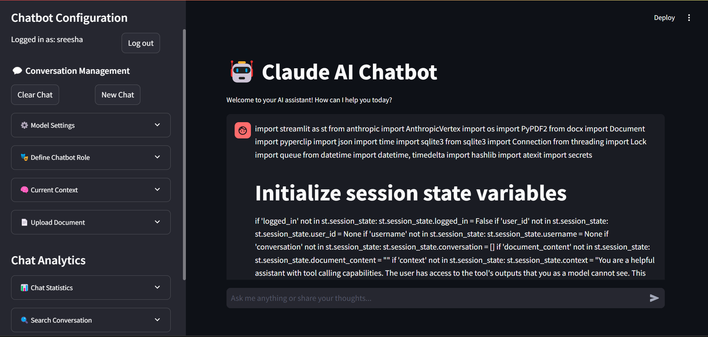

# Claude AI Chatbot



## 🤖 Overview

This project implements an interactive AI chatbot using Anthropic's Claude model via the AnthropicVertex API. Built with Streamlit, it provides a user-friendly interface for engaging in conversations with the AI, uploading documents for context, and managing chat history.

## 🌟 Features

- **Interactive Chat Interface**: Engage in real-time conversations with Claude AI.
- **Document Upload**: Support for PDF, DOCX, and TXT files to provide context to the AI.
- **Conversation Management**: Save, load, and delete conversation histories.
- **Customizable AI Context**: Define the AI's role and purpose for each conversation.
- **Message Statistics**: View word and token counts for each message.
- **Copy Functionality**: Easily copy individual messages or entire conversations.
- **Stream Responses**: AI responses are streamed in real-time for a dynamic experience.
- **Stop Generation**: Ability to stop the AI's response generation mid-stream.

## 📋 Prerequisites

- Python 3.7+
- Google Cloud Project with AnthropicVertex API enabled
- `credentials.json` file with your Google Cloud credentials

## 🚀 Installation

1. **Clone the repository:**

   ```bash
   git clone https://github.com/ssbaraar/GCPVertex-ClaudeChat-Pro.git
   
2. **Create a virtual environment:**

    ```bash
    python -m venv venv
    source .venv/bin/activate  # On Windows use venv\\Scripts\\activate
    
3. **Install the required packages:**

    ```bash
    pip install -r requirements.txt

4. **Set up your credentials:**

   Place your credentials.json file in the project root directory. This file should contain your Google Cloud credentials with access to the AnthropicVertex API.

   Example credentials.json file:
    ```bash
    {
   "location": "europe-west1",
   "project_id": "your-project-id",
   "model": "claude-3-5-sonnet@20240620"
    }
Replace "your-project-id" with your actual Google Cloud project ID.

## 🔧 Configuration
Ensure your credentials.json file is correctly configured.
Modify the LOCATION, PROJECT_ID, and MODEL variables in the script if necessary.

## 🚀 Running the Application
Run the Streamlit app:

    streamlit run app.py
    Navigate to the URL provided by Streamlit .

## 🛠️ Technologies Used

- Python
- Streamlit
- Anthropic API (via AnthropicVertex)
- Google Cloud AI Platform
- PyPDF2 (for PDF parsing)
- python-docx (for DOCX parsing)
- pyperclip (for copy functionality)

## 📚 Documentation and Tutorials

### 1. **Streamlit**
   - **Documentation**: Streamlit is a powerful Python framework for creating web apps, particularly useful for data science and machine learning projects. The official [Streamlit documentation](https://docs.streamlit.io/get-started) provides a comprehensive guide on how to get started, including installation and creating your first app.
   - **Tutorial**: The [30 Days of Streamlit](https://30days.streamlit.io) challenge is a free, self-paced tutorial that walks you through building and deploying Streamlit apps over 30 days.

### 2. **Anthropic API (via AnthropicVertex)**
   - **Documentation**: Anthropic provides an API to interact with their Claude models. This can be integrated with Google Cloud's Vertex AI platform for enhanced scalability and security. Detailed information is available on the [Anthropic website](https://www.anthropic.com/news/google-vertex-general-availability).
   - **Vertex AI and Anthropic API Documentation**: Learn more about integrating and deploying Claude models with [Google Cloud Vertex AI](https://cloud.google.com/vertex-ai/docs) and [Anthropic Vertex](https://cloud.google.com/vertex-ai/docs/generative-ai/anthropic-models).
   - **Tutorial**: While direct tutorials are less common, Google Cloud's [Vertex AI documentation](https://cloud.google.com/vertex-ai/docs/start/quickstarts) can guide you through deploying and managing models like Claude on their platform.

### 3. **Google Cloud AI Platform**
   - **Documentation**: Google Cloud's Vertex AI is where you can deploy, manage, and scale your AI models. The [Vertex AI documentation](https://cloud.google.com/vertex-ai/docs) offers all the information you need, from setup to model deployment.
   - **Tutorial**: You can follow this [Google Cloud tutorial](https://cloud.google.com/vertex-ai/docs/start/quickstarts) for step-by-step instructions on how to set up your project and deploy models using Vertex AI.

### 4. **PyPDF2 (for PDF parsing)**
   - **Documentation**: [PyPDF2's GitHub repository](https://github.com/py-pdf/PyPDF2) contains the codebase and documentation. It's a pure Python library that you can use to extract text and metadata from PDF files.
   - **Tutorial**: A basic guide on using PyPDF2 can be found on [Real Python](https://realpython.com/pdf-python/).

### 5. **python-docx (for DOCX parsing)**
   - **Documentation**: The official documentation for [python-docx](https://python-docx.readthedocs.io/en/latest/) explains how to manipulate .docx files, including reading, writing, and modifying them.
   - **Tutorial**: A good starting tutorial can be found on [Python Programming](https://pythonprogramming.net/reading-word-documents-python-docx-module/).

### 6. **pyperclip (for copy functionality)**
   - **Documentation**: Pyperclip is a simple cross-platform clipboard module for Python. The [Pyperclip documentation on PyPI](https://pypi.org/project/pyperclip/) provides installation instructions and basic usage examples.
   - **Tutorial**: There are brief tutorials and examples within the PyPI page itself, and you can find additional examples on GitHub.

## 🖥️ Usage
1. -Start a Conversation: Type your message in the chat input at the bottom of the page.
2. -Upload a Document: Use the sidebar to upload a PDF, DOCX, or TXT file for context.
3. -Manage Conversations: Clear the current chat, start a new one, or load previous conversations from the sidebar.
4. -Customize AI Context: Enter a specific role or instructions for the AI in the sidebar.
5. -Copy Messages: Use the copy buttons to copy individual messages or the entire conversation.
6. -View Message Stats: See word and token counts below each message.
7. -Stop Generation: Click the "Stop Generation" button to halt the AI's response mid-stream.
## 🔒 Security Notes
1. [x] Keep your credentials.json file secure and never commit it to version control.
2. [x] The app uses environment variables and secure handling for API credentials.
## 🔍 Code Structure
* app.py: Main application file containing the Streamlit interface and core logic.
* requirements.txt: List of Python package dependencies.
* .gitignore: Specifies intentionally untracked files to ignore..
## 🔐 Authentication

VertexClaude Pro uses a simple authentication system with a common password for all users. 

- **Default Password**: `claude2023`

To change the password:
1. Open the `app.py` file
2. Locate the `COMMON_PASSWORD` constant near the top of the file
3. Replace `"claude2023"` with your desired password
4. Save the file and restart the application

⚠️ **Important**: For production use, it's highly recommended to implement a more secure authentication system.

## 🛠️ Configuration

### Google Cloud & Anthropic Setup

1. Ensure you have a Google Cloud project with Vertex AI API enabled
2. Create a service account with necessary permissions for Vertex AI
3. Download the service account key as `credentials.json`
4. Place `credentials.json` in the root directory of the project

### Model Configuration

You can adjust the AI model settings in the sidebar:
- Temperature
- Top-p (nucleus sampling)
- Max tokens

### Chatbot Role

Customize the chatbot's role and purpose using the "Define Chatbot Role" section in the sidebar.

## 📚 Usage

1. Log in using your username and the common password
2. Start chatting with the AI assistant
3. Upload documents for context if needed
4. Adjust settings and explore features in the sidebar

## 🧠 AI Context

The AI uses a combination of:
- Recent conversation history
- Uploaded document content (if any)
- Custom role definition

This context is used to inform the AI's responses and maintain coherence throughout the conversation.

## 💾 Data Storage

Conversations and user data are stored in a SQLite database (`chatbot.db` by default). The application uses a connection pool for efficient database operations.

## 🚀 Deployment

For production deployment:
1. Set up a proper authentication system
2. Use environment variables for sensitive information
3. Consider using a more robust database system
4. Implement additional security measures as needed


## 🤝 Contributing

Contributions, issues, and feature requests are welcome! Feel free to check [issues page](https://github.com/ssbaraar/GCPVertex-ClaudeChat-Pro/issues).

## 📧 Contact

Your Name - ssbaraar02@gmail.com

Project Link: [Click Here](https://github.com/ssbaraar/GCPVertex-ClaudeChat-Pro)

---

🔓 Unlock the power of AI with VertexClaude Pro! 🚀

